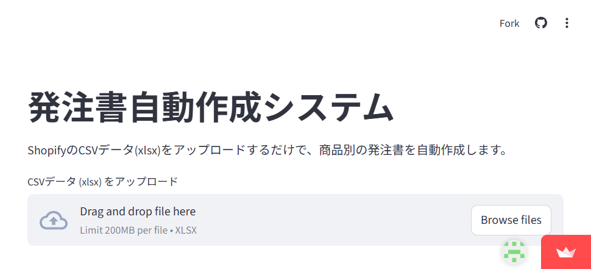
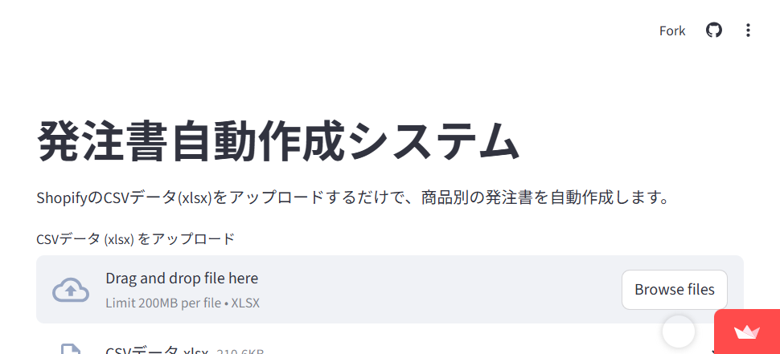
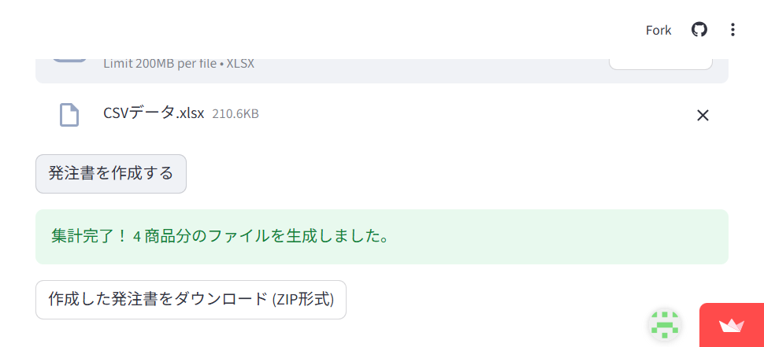

# 発注書自動作成システム 利用マニュアル

## 1. 概要
本システムは、Shopifyからエクスポートされた注文データ（Excel形式）を読み込み、商品ごとに集計された発注書（Excel形式）を自動的に作成するツールです。
手作業での転記ミスを防ぎ、発注業務の効率化を実現します。

## 2. 主な機能
- **自動集計**: SKU、色、サイズ（S〜XXXL）に基づいた数量の自動合計。
- **テンプレート適用**: 指定のExcelレイアウトに沿った発注書の生成。
- **一括処理**: 複数の商品を一度に処理し、ZIP形式でまとめてダウンロード可能。

## 3. 利用手順

### ステップ 1: アプリへのアクセス
以下のURLにアクセスします。
`https://purchaseorderautomatedinputsystem-m8uhpofsw6lavr7wjymhnc.streamlit.app/`

### ステップ 2: ファイルのアップロード
「CSVデータ (xlsx) をアップロード」エリアに、Shopifyから書き出したExcelファイルをドラッグ＆ドロップするか、「Browse files」ボタンから選択します。

### ステップ 3: 発注書の作成開始
ファイルが正しく読み込まれると、「発注書を作成する」ボタンが表示されます。このボタンをクリックして処理を開始します。

### ステップ 4: ダウンロード
処理が完了すると、「集計完了！」というメッセージと共に、ダウンロードボタンが表示されます。
「作成した発注書をダウンロード (ZIP形式)」ボタンをクリックして、生成されたファイルを保存してください。

## 4. 注意事項
- **ファイル形式**: アップロードできるのは `.xlsx` 形式のみです。
- **データ項目**: Shopifyの書き出しデータに「Lineitem name」（商品名、色、サイズを含む）と「Lineitem sku」が含まれている必要があります。
- **サイズ対応**: 現在、`S`, `M`, `L`, `XL`, `XXL`, `XXXL` のサイズ表記に対応しています。

---
*作成日: 2026年3月25日*
